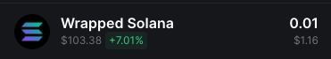

# Solana Sniper Bot
This code is written as proof of concept for demonstrating how we can buy new tokens immediately after liquidity pool is open for trading.

Script listens to new raydium USDC/SOL pools and buys token for a fixed amount in USDC/SOL.  
Depending on speed of RPC node, the purchase usually happens before token is available on Raydium UI for swapping.

## Setup
In order to run the script you need to:
- Create a new empty Solana wallet
- Transfer some SOL to it.
- Convert some SOL to USDC or WSOL.
  - You need USDC or WSOL depending on configuration set below.
- Configure the script by updating `.env.copy` file (remove the .copy from the file name when done).
  - PRIVATE_KEY (your wallet private key)
  - RPC_ENDPOINT (https RPC endpoint)
  - RPC_WEBSOCKET_ENDPOINT (websocket RPC endpoint)
  - QUOTE_MINT (which pools to snipe, USDC or WSOL)
  - QUOTE_AMOUNT (amount used to buy each new token)
  - COMMITMENT_LEVEL
  - USE_SNIPE_LIST (buy only tokens listed in snipe-list.txt)
  - SNIPE_LIST_REFRESH_INTERVAL (how often snipe list should be refreshed in milliseconds)
- Install dependencies by typing: `npm install`
- Run the script by typing: `npm run buy` in terminal

You should see the following output:  

## Snipe list
By default, script buys each token which has new liquidity pool created and open for trading. 
There are scenarios when you want to buy one specific token as soon as possible during the launch event.
To achieve this, you'll have to use snipe list.
- Change variable `USE_SNIPE_LIST` to `true`
- Add token mint addresses you wish to buy in `snipe-list.txt` file
  - Add each address as a new line

This will prevent script from buying everything, and instead it will buy just listed tokens.
You can update the list while script is running. Script will check for new values in specified interval (`SNIPE_LIST_REFRESH_INTERVAL`).

Pool must not exist before the script starts.
It will buy only when new pool is open for trading. If you want to buy token that will be launched in the future, make sure that script is running before the launch.

## Auto Sell
By default, auto sell is disabled. If you want to enable it, you need to:
- Change variable `AUTO_SELL` to `true`
- Update `SELL_DELAY` to the number of milliseconds you want to wait before selling the token

This will sell the token after the specified delay. (+- RPC node speed)

This feature is **experimental** and should be used with caution. Make sure you understand the risks before enabling it. There is no guarantee that the token will be sold at a profit or even sold at all. The developer is not responsible for any losses incurred by using this feature.

## Common issues
If you have an error which is not listed here, please create a new issue in this repository.

### Empty transaction
- If you see empty transactions on SolScan most likely fix is to change commitment level to `finalized`.

### Unsupported RPC node
- If you see following error in your log file:  
  `Error: 410 Gone:  {"jsonrpc":"2.0","error":{"code": 410, "message":"The RPC call or parameters have been disabled."}, "id": "986f3599-b2b7-47c4-b951-074c19842bad" }`  
  it means your RPC node doesn't support methods needed to execute script.
  - FIX: Change your RPC node. You can use Helius or Quicknode.

### No token account
- If you see following error in your log file:  
  `Error: No SOL token account found in wallet: `  
  it means that wallet you provided doesn't have USDC/WSOL token account.
  - FIX: Go to dex and swap some SOL to USDC/WSOL. For example when you swap sol to wsol you should see it in wallet as shown below:

## Support
If you want to support my work, you can donate to my Solana wallet:
`DM5buFVo7Fc3h6fb9W2f43RNARxWAmpkA3eSRQGDDQfw`

## Contact

