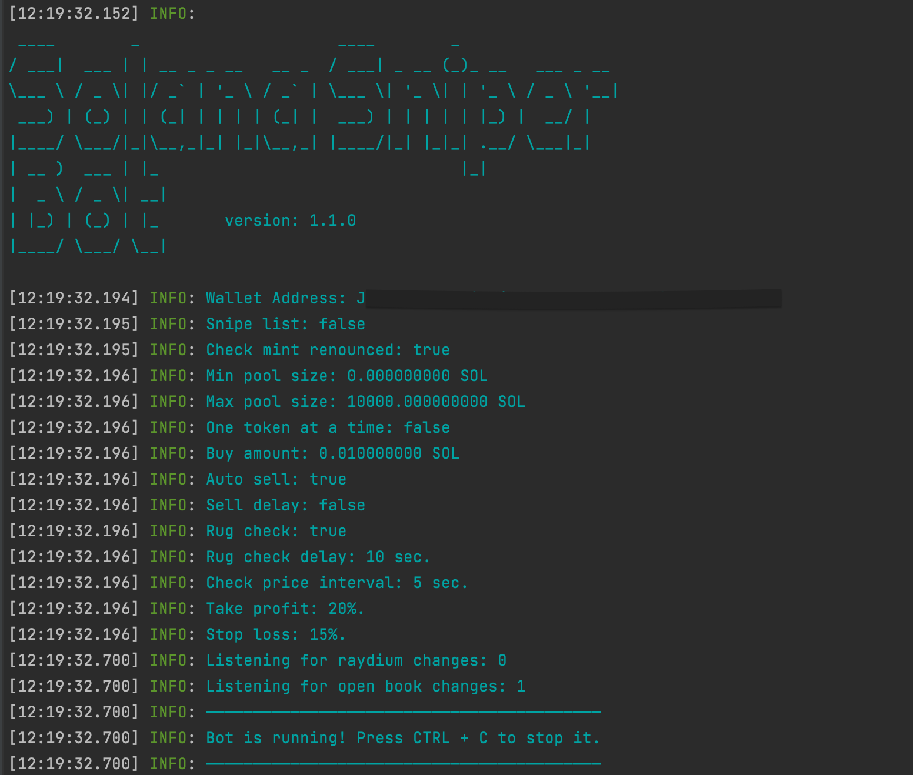

# Solana Sniper Bot (Poc)
This code is written as proof of concept to demonstrate how we can buy new tokens immediately after the liquidity pool is open for trading.

Script listens to new Raydium USDC or SOL pools and buys tokens for a fixed amount in USDC/SOL.  
Depending on the speed of the RPC node, the purchase usually happens before the token is available on Raydium UI for swapping.

This is provided as is, for learning purposes.

## Setup
To run the script you need to:
- Create a new empty Solana wallet
- Transfer some SOL to it.
- Convert some SOL to USDC or WSOL.
  - You need USDC or WSOL depending on the configuration set below.
- Configure the script by updating `.env.copy` file (remove the .copy from the file name when done).
  - Check [Configuration](#configuration) section bellow
- Install dependencies by typing: `npm install`
- Run the script by typing: `npm run start` in terminal

You should see the following output:  

### Configuration

#### Wallet
- `PRIVATE_KEY` - Your wallet's private key.

#### Connection
- `RPC_ENDPOINT` - HTTPS RPC endpoint for interacting with the Solana network.
- `RPC_WEBSOCKET_ENDPOINT` - WebSocket RPC endpoint for real-time updates from the Solana network.
- `COMMITMENT_LEVEL`- The commitment level of transactions (e.g., "finalized" for the highest level of security).

#### Bot
- `LOG_LEVEL` - Set logging level, e.g., `info`, `debug`, `trace`, etc.
- `ONE_TOKEN_AT_A_TIME` - Set to `true` to process buying one token at a time.
- `COMPUTE_UNIT_LIMIT` - Compute limit used to calculate fees.
- `COMPUTE_UNIT_PRICE` - Compute price used to calculate fees.
- `PRE_LOAD_EXISTING_MARKETS` - Bot will load all existing markets in memory on start.
  - This option should not be used with public RPC.
- `CACHE_NEW_MARKETS` - Set to `true` to cache new markets.
  - This option should not be used with public RPC.
- `TRANSACTION_EXECUTOR` - Set to `warp` to use warp infrastructure for executing transactions
  - For more details checkout [warp](#warp-transactions-beta) section
- `WARP_FEE` - If using warp executor this value will be used for transaction fees instead of `COMPUTE_UNIT_LIMIT` and `COMPUTE_UNIT_LIMIT`
  - Minimum value is 0.0001 SOL, but we recommend using 0.006 SOL or above 
#### Buy
- `QUOTE_MINT` - Amount used to buy each new token.
- `QUOTE_AMOUNT` - Which pools to snipe, USDC or WSOL.
- `AUTO_BUY_DELAY` - Delay in milliseconds before buying a token.
- `MAX_BUY_RETRIES` - Maximum number of retries for buying a token.
- `BUY_SLIPPAGE` - Slippage %

#### Sell
- `AUTO_SELL` - Set to `true` to enable automatic selling of tokens.
- `MAX_SELL_RETRIES` - Maximum number of retries for selling a token.
- `AUTO_SELL_DELAY` -  Delay in milliseconds before auto-selling a token.
- `PRICE_CHECK_INTERVAL` - Interval in milliseconds for checking the take profit and stop loss conditions.
- `PRICE_CHECK_DURATION` - Time in milliseconds to wait for stop loss/take profit conditions.
  - If you don't reach profit or loss bot will auto sell after this time.
- `TAKE_PROFIT` - Percentage profit at which to take profit.
  - Take profit is calculated based on quote mint.
- `STOP_LOSS` - Percentage loss at which to stop the loss.
  - Stop loss is calculated based on quote mint.
- `SELL_SLIPPAGE` - Slippage %.

#### Filters
- `USE_SNIPE_LIST` - Set to `true` to enable buying only tokens listed in `snipe-list.txt`.
  - Pool must not exist before the script starts.
- `SNIPE_LIST_REFRESH_INTERVAL` - Interval in milliseconds to refresh the snipe list.
- `CHECK_IF_MINT_IS_RENOUNCED` - Set to `true` to buy tokens only if their mint is renounced.
- `CHECK_IF_BURNED` - Set to `true` to buy tokens only if their liqudity pool is burned.
- `MIN_POOL_SIZE` - Bot will buy only if the pool size is greater than the specified amount.
  - Set `0` to disable.
- `MAX_POOL_SIZE` - Bot will buy only if the pool size is less than the specified amount.
  - Set `0` to disable.

## Warp transactions (beta)
In case you experience a lot of failed transactions or transaction performance is too slow, you can try using `warp` for executing transactions.
Warp is hosted service that executes transactions using integrations with third party providers.

Using warp for transactions supports the team behind this project.

### Security
When using warp, transaction is sent to the hosted service.
**Payload that is being sent will NOT contain your wallet private key**. Fee transaction is signed on your machine.
Each request is processed by hosted service and sent to third party provider.
**We don't store your transactions, nor we store your private key.**

Note: Warp transactions are disabled by default.

### Fees
When using warp for transactions, fee is distributed between developers of warp and third party providers.
In case TX fails, no fee will be taken from your account.

## Common issues
If you have an error which is not listed here, please create a new issue in this repository.
To collect more information on an issue, please change `LOG_LEVEL` to `debug`.

### Unsupported RPC node
- If you see following error in your log file:  
  `Error: 410 Gone:  {"jsonrpc":"2.0","error":{"code": 410, "message":"The RPC call or parameters have been disabled."}, "id": "986f3599-b2b7-47c4-b951-074c19842bad" }`  
  it means your RPC node doesn't support methods needed to execute script.
  - FIX: Change your RPC node. You can use Helius or Quicknode.

### No token account
- If you see following error in your log file:  
  `Error: No SOL token account found in wallet: `  
  it means that wallet you provided doesn't have USDC/WSOL token account.
  - FIX: Go to dex and swap some SOL to USDC/WSOL. For example when you swap sol to wsol you should see it in wallet as shown below:

## Contact

- If you want to leave a tip, you can send it to the following address:
`7gm6BPQrSBaTAYaJheuRevBNXcmKsgbkfBCVSjBnt9aP`

- If you need custom features or assistance, feel free to contact the admin team on discord for dedicated support.

## Disclaimer

Use this script at your own risk.
